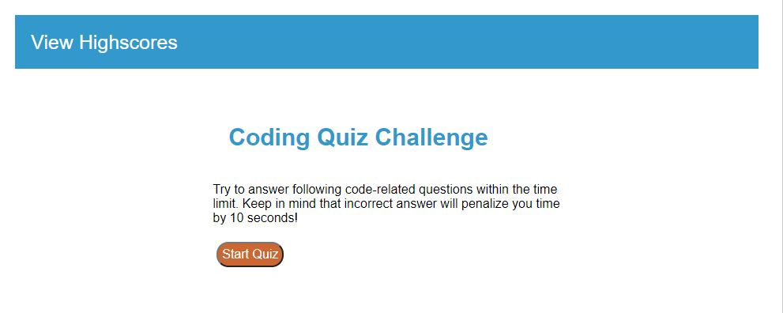
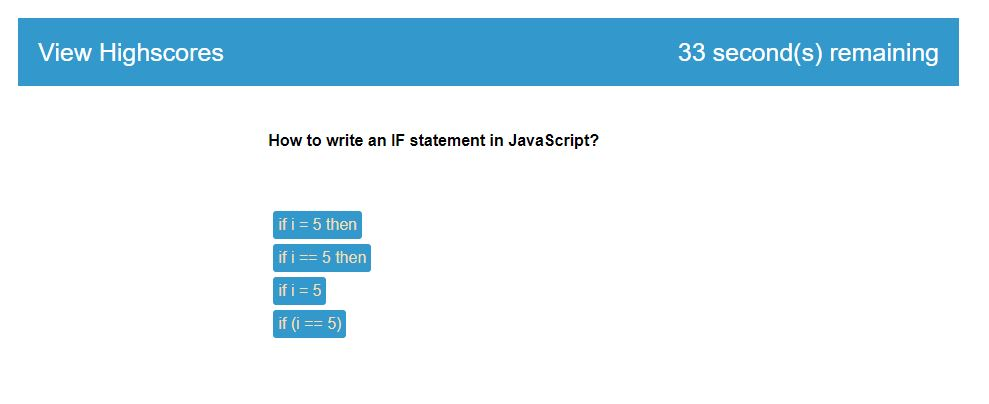
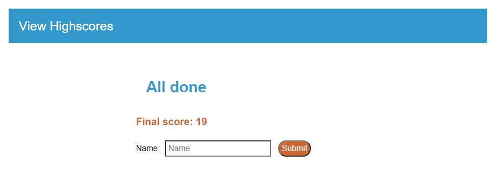
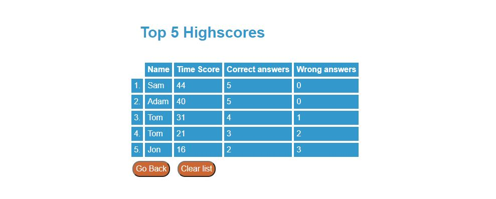

# 04-Web-APIs-Code-Quiz

This is timed quiz on JavaScript fundamentals that stores high scores.

When you click the "Start Quiz" button, a timer starts.

You will need to answer questions.

If the answer is incorrect, then time is subtracted.

If all questions are answered or the timer reaches 0, then the game is over.

After the game you can enter yuor Name, and it will store result.

You can view High Score result by clickig "View Highscores" link on header.

## Link to website
https://juliusm9791.github.io/04-Web-APIs-Code-Quiz/

## Mock-Up
The following images shows the web application's appearance and functionality:

© 2021 Julius Markauskas